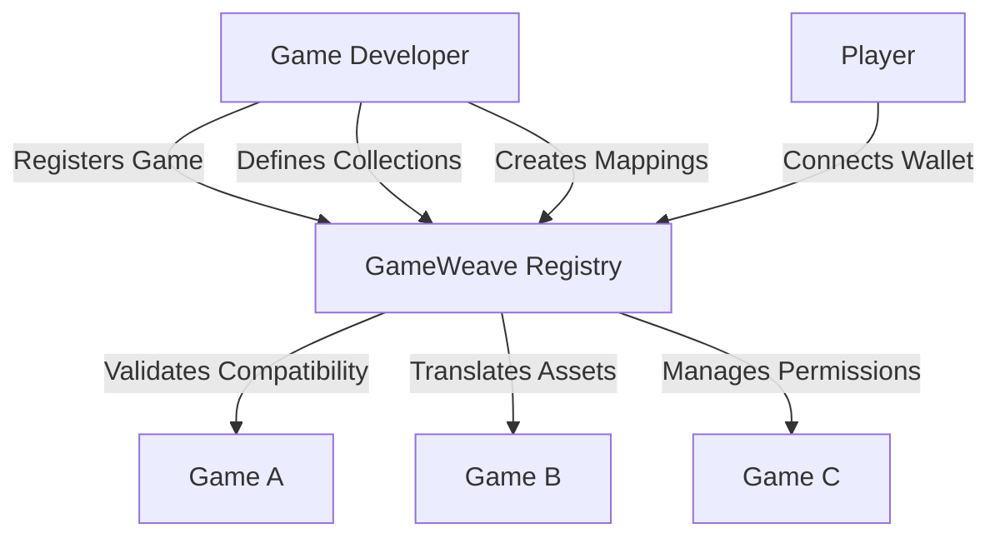

# GameWeave NFT Interoperability Platform

GameWeave is a standardized protocol that enables game developers to make their in-game NFT assets interoperable across multiple games on the Stacks blockchain. This platform serves as a central registry and translation layer, allowing players to truly own and seamlessly use their digital assets across different gaming environments.

## Overview

GameWeave increases the long-term value and utility of gaming NFTs by:
- Enabling cross-game compatibility of NFT assets
- Providing a standardized translation layer for asset attributes
- Creating new gameplay possibilities through asset interoperability
- Fostering a more interconnected gaming ecosystem on Stacks

## Architecture

The platform consists of a central registry contract that manages game registrations, NFT collections, and asset mappings between games.



### Core Components
- **Game Registry**: Maintains a database of registered games and their owners
- **Collection Management**: Tracks NFT collections supported by each game
- **Asset Mappings**: Defines how NFT attributes translate between games
- **Permission System**: Ensures only authorized parties can modify game settings

## Contract Documentation

### GameWeave Registry (`gameweave-registry.clar`)

#### Purpose
Central hub for managing game registrations, NFT collections, and asset mappings.

#### Key Features
- Game registration and management
- NFT collection registration
- Cross-game asset mapping
- Attribute translation rules
- Permission management

#### Access Control
- Contract Owner: Can update contract ownership
- Game Owners: Can manage their game settings, collections, and mappings

## Getting Started

### Prerequisites
- Clarinet
- Stacks wallet
- Access to the Stacks blockchain

### Installation
1. Clone the repository
2. Install dependencies
3. Deploy the contract using Clarinet

### Basic Usage

```clarity
;; Register a new game
(contract-call? .gameweave-registry register-game 
    "game-123"
    "My Game"
    "Description"
    (some "https://metadata.uri")
)

;; Register an NFT collection
(contract-call? .gameweave-registry register-collection
    "game-123"
    'ST1PQHQKV0RJXZFY1DGX8MNSNYVE3VGZJSRTPGZGM
    "Collection Name"
    "Collection Description"
    (list "attribute1" "attribute2")
)
```

## Function Reference

### Game Management

```clarity
(register-game (game-id (string-ascii 64)) (name (string-utf8 100)) (description (string-utf8 500)) (metadata-uri (optional (string-utf8 256))))
```
Registers a new game in the GameWeave ecosystem.

```clarity
(update-game (game-id (string-ascii 64)) (name (string-utf8 100)) (description (string-utf8 500)) (metadata-uri (optional (string-utf8 256))) (active bool))
```
Updates existing game information.

### Collection Management

```clarity
(register-collection (game-id (string-ascii 64)) (collection-contract principal) (name (string-utf8 100)) (description (string-utf8 500)) (attributes (list 20 (string-ascii 64))))
```
Registers an NFT collection for a game.

### Asset Mapping

```clarity
(create-asset-mapping (source-game-id (string-ascii 64)) (source-collection principal) (target-game-id (string-ascii 64)) (target-collection principal) (attribute-mappings (list 20 {...})))
```
Creates a mapping between assets in different games.

## Development

### Testing
1. Run the test suite:
```bash
clarinet test
```

### Local Development
1. Start a local Clarinet console:
```bash
clarinet console
```

2. Deploy the contract:
```clarity
(contract-call? .gameweave-registry ...)
```

## Security Considerations

### Limitations
- Asset mappings are one-directional
- Maximum of 20 attributes per collection
- Maximum string lengths enforced for names and descriptions

### Best Practices
- Always verify game ownership before operations
- Implement proper access control in integrated games
- Test attribute mappings thoroughly before deployment
- Monitor active mappings for potential conflicts
- Regularly audit collection compatibility rules